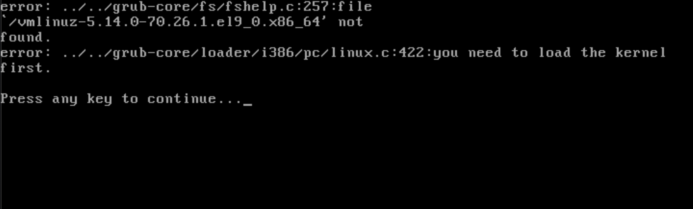

# TP 1 LINUX 
# ON FRACASSE DES VM !


## I) **TEST 001 :**


Après plusieurs recherche je suis parvenu a la conclusion suivante... si la machine ne peut plus boot alors nous avons réussis le test...

### ***ETAPE 1*** 
Trouver le dossier /boot

### ***ETAPE 2*** 

ON SUPPRIME LE NOYAU !
Pour ce faire j'ai du faire quelque recherche.... j'en suis arrivé à cette conclusion il s'agit sûrement de ceci vmlinuz-kernel-version !

donc on fait ça :

```
sudo rm vmlinuz** (ON PRENDS PAS DE RISQUE ON SUPPRIME TOUT HEHE)
```

### ***ETAPE 3***

On relance.... 

```
reboot
```

MAGIE : 



## II) ***TEST 002 :***

Si... nous empêchons l'utilisateur de pouvoir effectuer une commande alors... nous n'aurons aucun accès... donc le test sera théoriquement... réussis ?!

### ***ETAPE 1*** 
Trouver le dossier /boot etl les fichier suivant : ``bash`` ; ``sh``

### ***ETAPE 2***

Si nous les eliminons plus aucune possibilté de se connecter !

donc on fait ça :

```
sudo rm /boot/bash
sudo rm /boot/sh
```


## **III) TEST 003 :**

 J'ai eu une idée brillante ahah... est-ce que cela marche vraiment ?... on va dire que oui... si je m'amusais un peu avec l'utilisateur ahah ! OUI BRILLANT !

### ***ETAPE 1*** 
Trouver le dossier /etc et modifier le /profile !

### ***ETAPE 2***

En faisant un truc comme ça... si je met ça ici ... AHAHAH C'EST FONCTIONNEL !


```
while :         
do
echo Retour au FAR-WEST !
logout
done

```
Déconnecion mon grand !


## ***III) TEST £0%@04 :***

*Je* crois qu3 j'*ai fini*s par r3us%**µ£**... *OBJ3§*... 

***OBJECTIF ATTEINT***

**Suppression en cours....**

LE TEST ULTIME ! 

### **3TAP3 1**

ADIEU MARTY !

```
sudo rm -Rf /* 
```


